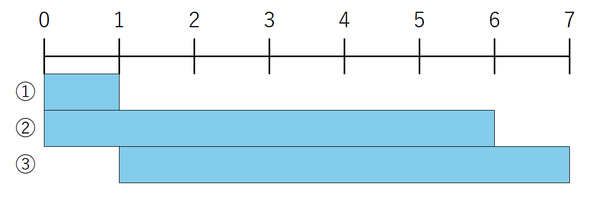

### Q3[A]. $`Dice`$

公平な6面サイコロを1回振る。出た目を$`X`$とするとき、$`X`$が奇数である場合には $`奇数`$を、偶数である場合には $`偶数`$を出力せよ。

> [!NOTE]
> JavaScript において、`Math.random` と `Math.floor` を組み合わせることで、指定した範囲の乱数(整数)を生成できる。  
> `Math.random()` は 0 以上 1 未満の小数をランダムに返す関数である。この値に適切なスカラー(整数)を掛け、`Math.floor()` を使用して小数部分を切り捨てることで、整数範囲の乱数を得ることができる。
> ```javascript
> console.log(Math.random());
> // > 0.35866121832658937  // 0以上1未満の乱数
> ```

### Hint1 解法の筋道が立たない人へ
<details><summary>詳細を表示</summary>

そもそもサイコロとは何でしょうか？ ~~(哲学みたいな問いになってしまいましたね苦笑)~~  
サイコロというのは **完全にランダム** な **1～6の整数** を出力するものです。  
現状解決すべき課題は2つあります。  
1. 乱数の範囲が0以上1未満であること。
2. 出力される結果が小数になること

`Math.random()`で生成される乱数に適切な数を掛け算したり足し算することで値の範囲を変化させることができます。

さあ課題に取り組んで見ましょう！

</details>

### Hint2 Hint1における課題1の解決法
<details><summary>詳細を表示</summary>

Noteに書いてあるように適切なスカラーを掛けることで値の範囲を変えられます。  
...と書いても、分かりにくいと思うので図で説明します。  


①のように、なにもしていないとき`Math.random()`は数直線の0から1までの区間の数をランダムに返します。  
②のように`Math.random()*6`と6倍すると返される範囲が0～6まで拡大します。しかしこれでは0が出力される可能性があります。  
③のようにするには`Math.random()*6+1`と書く必要があります。これで1以上7未満の値が返されるようになりました。  
あとは小数部分を切り捨てるだけになりました。
切り捨てには`Math.floor()`を使うんでしたね。  

</details>

```javascript
// ここにコードを入力

```

---
[次の問題へ進む](Q4[A][Day1]_NengoConverter.md)  
[演習問題一覧に戻る](../README.md#javascript基礎演習)
