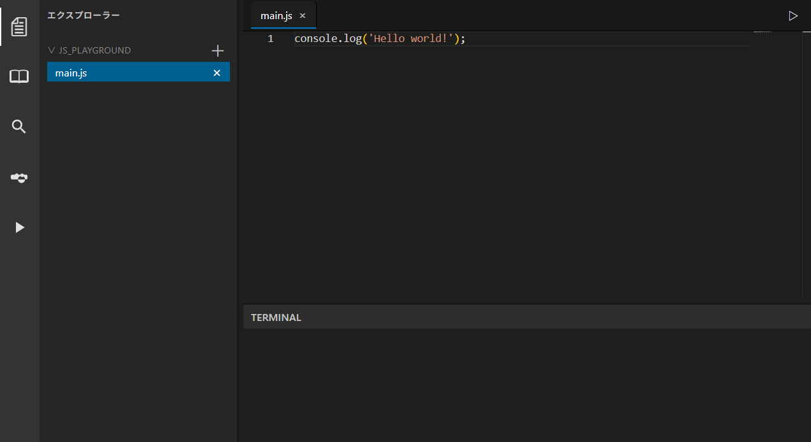
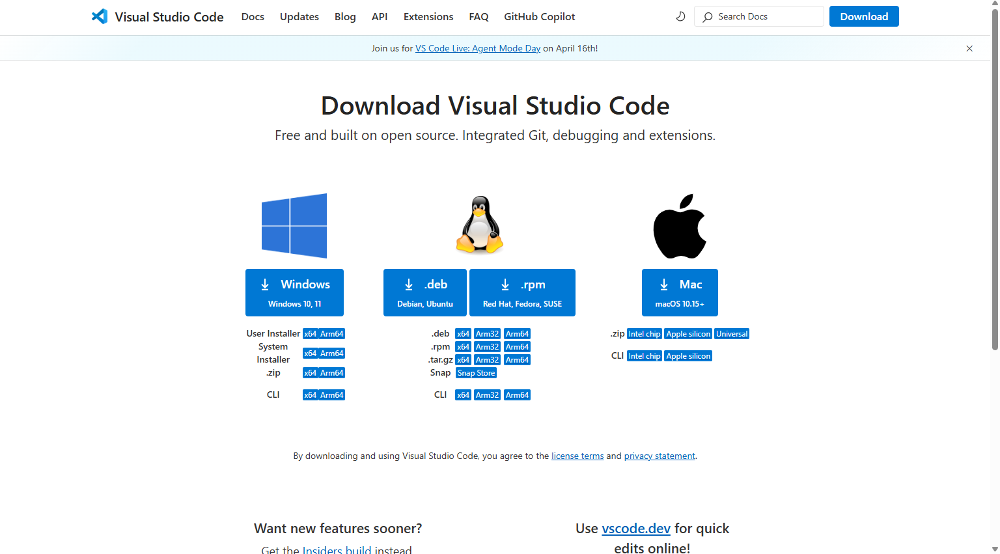
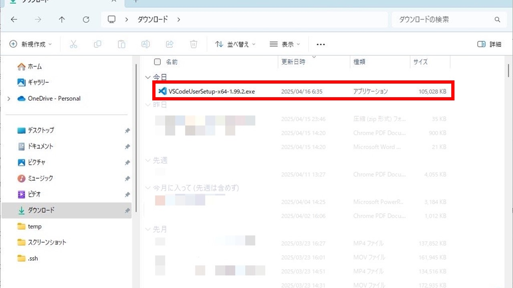
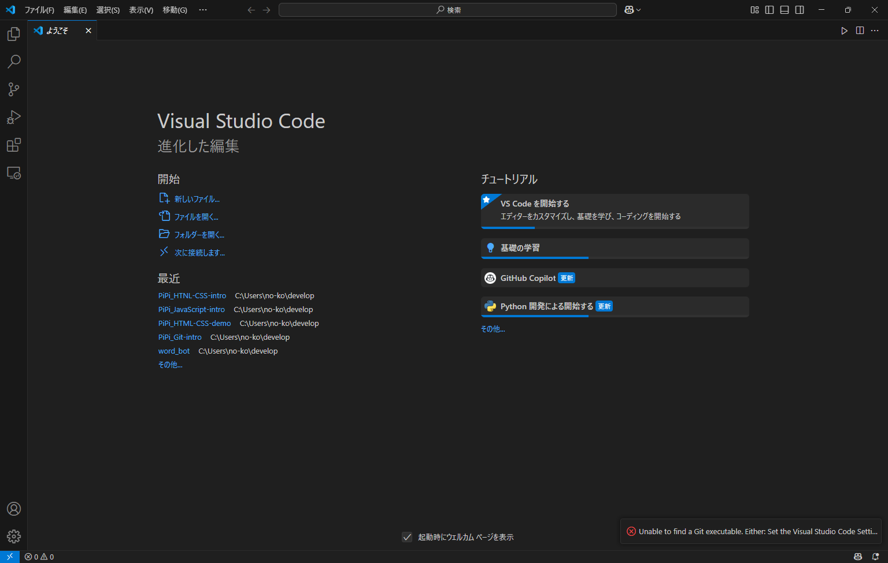
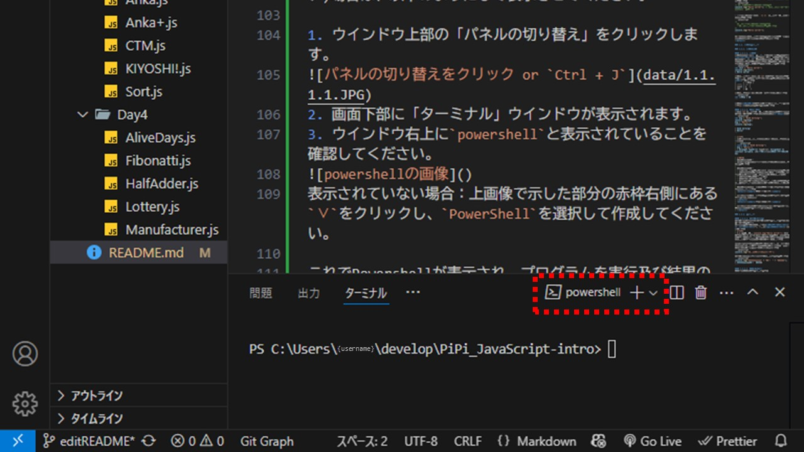
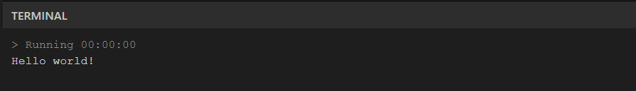
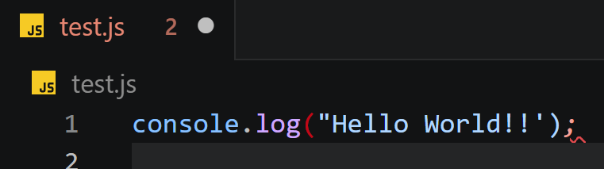

# Digitart_BasicProgrammingWorkshop

プログラミング基礎講習会では、Web開発において不可欠なプログラミング言語であるJavaScriptを通して基礎的な文法を学びます。  

## 目次

- はじめに
  - [環境整備(ブラウザ)](#0a0-ブラウザ上で動かす場合)
  - [環境整備(ローカル)](#0b0-ローカルで動かす場合)
- Javascript基礎講習
  - Javascript開発の基礎
    - [Hello world!](#111-hello-world)
    - [コード記述のルール](#112-コード記述のルール)
    - [エラーメッセージ](#113-エラーメッセージ)
  - 変数とデータ型
    - [変数と定数](#121-変数と定数)
    - [データ型](#122-データ型)
  - 演算子
    - [算術演算子](#131-算術演算子)
    - [グループ化演算子](#132-グループ化演算子)
    - [比較演算子](#133-比較演算子)
  - 制御構文
    - [条件分岐](#141-条件分岐)
    - [反復処理](#142-反復処理)
  - 配列
    - [配列](#15-配列)
  - 関数
    - [関数の定義と実行](#161-関数の定義と実行)
    - [引数と戻り値](#162-引数と戻り値)
    - [スコープ](#163-スコープ)
- JavaScript基礎演習
  - Day1
    - [Q1[A][Day1]](
        Exercises_questions/Q1[A][Day1]_TimeConversion.md
      ). $TimeConversion$
    - [Q2[A][Day1]](
        Exercises_questions/Q2[A][Day1]_Shopping.md
      ). $Shopping$
    - [Q3[A][Day1]](
        Exercises_questions/Q3[A][Day1]_Dice.md
      ). $Dice$
    - [Q4[A][Day1]](
        Exercises_questions/Q4[A][Day1]_NengoConverter.md
      ). $NengoConverter$
    - [Q5[A][Day1]](
        Exercises_questions/Q5[A][Day1]_LeapYear.md
      ). $LeapYear$
  - Day2
    - [Q6[A][Day2]](
        Exercises_questions/Q6[A][Day2]_Sigma.md
      ). $Sigma$
    - [Q7[A][Day2]](
        Exercises_questions/Q7[A][Day2]_MultiplicationTable.md
      ). $MultiplicationTable$
    - [Q8[B][Day2]](
        Exercises_questions/Q8[B][Day2]_Sqrt.md
      ). $Sqrt$
    - [Q9[B][Day2]](
        Exercises_questions/Q9[B][Day2]_Binary.md
      ). $Binary$
    - [Q10[B][Day2]](
        Exercises_questions/Q10[B][Day2]_Euclidean.md
      ). $Euclidean$
  - Day3
    - [Q11[A][Day3]](
        Exercises_questions/Q11[A][Day3]_CTM.md
      ). $CTM$
    - [Q12[A][Day3]](
        Exercises_questions/Q12[A][Day3]_Anka.md
      ). $Anka$
    - [Q13[B][Day3]](
        Exercises_questions/Q13[B][Day3]_Anka+.md
      ). $Anka+$
    - [Q14[B][Day3]](
        Exercises_questions/Q14[B][Day3]_KIYOSHI!.md
      ). $KIYOSHI!$
    - [Q15[B][Day3]](
        Exercises_questions/Q15[B][Day3]_Sort.md
      ). $Sort$
  - Day4
    - [Q16[B][Day4]](
        Exercises_questions/Q16[B][Day4]_Manufacturer.md
      ). $Manufacturer$
    - [Q17[B][Day4]](
        Exercises_questions/Q17[B][Day4]_AliveDays.md
      ). $AliveDays$
    - [Q18[B][Day4]](
        Exercises_questions/Q18[B][Day4]_Lottery.md
      ). $Lottery$
    - [Q19[C][Day4]](
        Exercises_questions/Q19[C][Day4]_Fibonatti.md
      ). $Fibonatti$
    - [Q20[C][Day4]](
        Exercises_questions/Q20[C][Day4]_HalfAdder.md
      ). $HalfAdder$

## 0. はじめに
今回の実習で使うものの準備をします！
### 0.A.0. ブラウザ上で動かす場合
任意のwebブラウザ(Google Chromeなど)とインターネット環境があれば十分です。  
  
次のページにアクセスして下さい。  
https://www.chrom.jp/playground  

このサイト上でJavaScriptのコードを実行することができます。  
> [!NOTE]
> このサイト上で書いたコードは保存されません(リロードするとリセットされます)。  
> 自分の手元に保存する際には、画面左側のサイドバーから「実行とデバッグ(三角形のアイコン)」をクリックし、「Download Code」を実行して下さい。

[次の章へ進む](#1-javascript基礎講習)  

### 0.B.0. ローカルで動かす場合
プログラミング基礎講習では事前に以下の環境が整っている前提で進められます。
 - Visual Studio Code  
 - Node.js

<details><summary>VScodeのダウンロード手順</summary>

1. Visual Studio Code のダウンロード用サイト( https://code.visualstudio.com/download )にアクセスし、対応するOSのものをダウンロードする。


2. ダウンロードされたexeファイル(`VSCodeUserSetup-x64-1.99.2.exe`など)を展開し、画面上に表示される指示に従いセットアップする。(基本的には初期設定のままでOK)


3. インストールが完了したら、「完了(F)」をクリックしてインストールを終了する。中央にあるチェックボックスにチェックが入っていると、終了と同時にVisual Studio Codeが起動する。


</details>

> [!IMPORTANT]
> 何か問題が起きたら気軽に相談しましょう！

#### 0.B.1. フォルダの作成
演習用のファイルを収納するフォルダを作成しましょう！  
自分の好きな場所に作成して大丈夫ですが、以下のようにファイルを作成することをお勧めします。
> 1. `C: > User > {UserName}`直下に`develops`フォルダを作成する。
> 2. その下に`Digitart > Javascript`とファイルを作成する。


#### 0.B.2. VS Code上で表示
VS Codeを起動し、`フォルダーを開く`から先ほど作成したフォルダを選択し、右下部`フォルダの選択`をクリックしてください。 
これにより、フォルダ内のファイルがVS Code上で表示され、編集可能になります。  
また、フォルダを開いた状態で新しいファイルを作成するには、エクスプローラーの上部にある「新しいファイル」アイコンをクリックし、ファイル名を入力してください。  
練習: `tutorial.js` という名前のファイルを作成してください。


#### 0.B.3. Node.jsのインストール
PowerShell上で以下のコマンドを実行するなり何なりしてNode.jsをインストールしましょう。  
Node.jsはバージョンの違いで期待通りの動作をしないことがあるので、バージョン管理ツールを使用することをおすすめします。  
コマンドでは"volta"というツールを使う方法を紹介します。(他にも色々ある)
```bash
winget install Volta.Volta
volta install node
volta install npm
```

<details><summary>PowerShellが表示されない場合</summary>

PowerShellが表示されていない(画面下部にウインドウがない)場合は、以下のようにして表示させてください。

1. ウインドウ上部の「パネルの切り替え」をクリックします。

2. 画面下部に「ターミナル」ウインドウが表示されます。
3. ウインドウ右上に`powershell`と表示されていることを確認してください。

表示されていない場合：上画像で示した部分の赤枠右側にある`∨`をクリックし、`PowerShell`を選択して作成してください。

これでPowershellが表示され、プログラムを実行及び結果の確認をすることができます。
</details>

> [!TIP]
> Node.jsとは
> JavaScript実行環境の1つである。いろいろ入っています(雑)。今後、web開発をするのであればほぼ必須の技術です。詳しくは調べて下さい。


## 1. JavaScript基礎講習

### 1.1. JavaScript開発の基礎

#### 1.1.1. Hello world!
早速ですがプログラミングを始めていきましょう！  
"出力(console)"に「Hello world!」という文字を出してみます。
以下のコードを書いてから実行してみましょう。

```javascript
console.log("Hello world!");
```

JavaScript実行環境(https://www.chrom.jp/playground )を使っている方は、画面右上の三角形のアイコンをクリックすると実行できます。

> [!TIP]
> - Hello world!とは  
>   プログラミング言語の学習を始めるにあたって、必ず最初に唱えることになっているおまじないである。  
>   このおまじないを唱えると画面に「Hello World!」と表示され、動作はただそれだけである。  
>   初学者の学習の道筋を清めるための一種の地鎮祭のようなものである。  

ターミナルに「Hello world!」と表示されたら成功です。  
`console.log()`というコマンドで、括弧内の要素をコンソールへ出力することができるので覚えておきましょう。

<details><summary>ローカル環境でエラーが出るとき</summary>

次のようなエラーが表示されますか?!

```bash
error: Module not found "tutorial.js"
```

このエラーは現在のディレクトリに実行したいファイル(`tutorial.js`など)が存在しないときに表示されるエラーです。  
PowerShellにも、エクスプローラーと同じように現在表示している場所（カレントディレクトリ）があります。カレントディレクトリは既にPowerShell上に表示されています。文字を入力できる箇所の左側に次のような文字列が表示されているはずです。

```bash
PS C:\Users\{UserName}\develops\Digitart\JavaScript> 
```

このような場合、その指し示す位置が現在表示している場所です。試しにエクスプローラーでその住所を表示してみてください。（例の場合、エクスプローラー上部のカレントディレクトリを示す場所に`C:\Users\{UserName}\develops\Digitart\JavaScript`と入力し実行する。）  

カレントディレクトリを実行したいファイルが収納されているフォルダに移動していきましょう！
ディレクトリの移動や内容の確認を行うために使用する基本的なコマンドが `ls` と `cd` です。

##### lsコマンド
`ls` は "list" の略で、現在のディレクトリ内のファイルやフォルダを一覧表示するために使用します。

- 基本構文:
  ```bash
  ls [オプション]
  ```
- 使用例:
  ```bash
  ls
  ```
  上記のコマンドは、現在のディレクトリ内のファイルやフォルダを一覧表示します。

##### cdコマンド
`cd` は "change directory" の略で、現在の作業ディレクトリを変更するために使用します。

- 基本構文:
  ```bash
  cd [ディレクトリ名]
  ```
- 使用例:
  ```bash
  cd PiedPiper
  ```
  上記のコマンドは、現在のディレクトリから `Digitart/` というディレクトリに移動します。

- 特殊な使い方:
  - `cd ..` : 親ディレクトリ(1つ上のディレクトリ)に移動します。
  - `cd ~` : ホームディレクトリに移動します。

</details>

> [!NOTE]
> コンソールとは、プログラムの実行結果やエラーメッセージなどを表示するための画面やウィンドウのことです。  
> プログラミングを行う際には、コンソールを使ってプログラムの動作を確認したりデバッグを行ったりします。  
> 実行すると、画面下部に「Hello world!」と表示されるはずです。  
> 
> 
> エンジニアが使いがちな「Visual Studio Code」では、画面下部に「出力」や「ターミナル」といったタブがあり、ここにプログラムの実行結果が出力されます。  
> プログラムが正しく動作しているかどうかを確認するために、コンソールを活用しましょう。

#### 1.1.2. コード記述のルール

<details><summary>1.1.2.1. 空白文字</summary>

空白文字は、コードの可読性を高めるために適切に使用する必要があります。JavaScriptでは、空白文字（スペース、タブ、改行など）は無視されるため、コードの動作には影響しませんが、適切に配置することでコードの見やすさが向上します。

例えば、次のように空白文字を使ってコードを整形します。

```javascript
let sum = 1 + 2; // スペースを使って可読性を向上
let product = 3 * 4; // スペースを使って可読性を向上

if (sum > product) {
  console.log("Sum is greater than product");
} else {
  console.log("Product is greater than or equal to sum");
}
```

このように、適切な場所に空白文字を入れることで、コードの可読性が向上し、他の開発者が理解しやすくなります。
</details>

<details><summary>1.1.2.2. セミコロン</summary>

JavaScriptでは、文の終わりにセミコロン（`;`）を付けることが推奨されています。セミコロンを付けることで、文の区切りが明確になり、コードの可読性が向上します。また、セミコロンを省略すると、JavaScriptの自動セミコロン挿入（ASI）機能により予期しない動作を引き起こす可能性があります。

例えば、次のようにセミコロンを省略した場合、意図しない結果になることがあります。

```javascript
let a = 1
let b = 2
let c = a + b
(function() {
  console.log(c)
})()
```

このコードはエラーを引き起こしますが、セミコロンを適切に挿入することで解決できます。

```javascript
let a = 1;
let b = 2;
let c = a + b;
(function() {
  console.log(c);
})();
```

このように、セミコロンを適切に使用することで、コードの予期しない動作を防ぐことができます。
</details>

<details><summary>1.1.2.3. コメント</summary>

コードにコメントを追加することで、コードの意図や動作を説明し、他の開発者や将来の自分が理解しやすくなります。JavaScriptでは、以下のようにコメントを記述します。

- シングルラインコメント: `//` を使って1行のコメントを記述します。
```javascript
// これはシングルラインコメントです
console.log("Hello world!"); // この行の後ろにもコメントを追加できます
```

- マルチラインコメント: `/* */` を使って複数行のコメントを記述します。
```javascript
/*
  これはマルチラインコメントです。
  複数行にわたるコメントを記述できます。
*/
console.log("Hello world!");
```

コメントを適切に使用することで、コードの可読性が向上し、他の開発者がコードを理解しやすくなります。
</details>

<details><summary>1.1.2.4. エラー表示</summary>
VScodeなどのテキストエディタは文法に存在するエラーを視覚的にわかりやすく伝えてくれます。
以下の画像のように色が赤くなったり、下線が引かれたりします。



この機能によってコードの間違いを素早く見つけることができるのです。

</details>

### 1.2. 変数とデータ型

### 1.2.1. 変数と定数

#### 1.2.1.1. 変数宣言
変数とは、プロフラムで使われる値を名前付きで管理する**ラベルのようなもの**です。プログラムを書いていると同じ値を何度も使ったり一時的に値を保持したいケースが出てきます。このようなときに次のように変数で値に対して名前を付けておけば任意のタイミングで繰り返し使用できます。
```javascript
let text = "Hello world!";
console.log(text);
> Hello world!
```
変数を使用する際には主に`let`というコマンドを記述します。また、一度値を設定すると変更ができない特殊な変数(**定数**)もあります。  
|       | 再代入 |
| :---: | :-: |
| const | ×   |
| let   | 〇   |

変数を使うにはまず変数の宣言をする必要があります。
```javascript
let 変数名 = 値
```

<details><summary>1.2.1.1.1. 大文字/小文字の区別</summary>

JavaScriptでは大文字と小文字が区別されます。例えば、`variable` と `Variable` は異なる変数として扱われます。次の例を見てみましょう。

```javascript
let variable = "小文字";
let Variable = "大文字";

console.log(variable);
console.log(Variable);
> 小文字
> 大文字
```

このように、変数名の大文字と小文字を間違えると意図しない動作を引き起こす可能性があるため、注意が必要です。
</details>

変数名(**識別子**という)はある程度決まった形式で命名しますが基本的に半角英数字で命名します。

#### 1.2.1.2. 値の再代入
まずは`let`を使って宣言した変数の値を上書きする方法について確認していきます。(このことを値の**再代入**という)
```javascript
let msg = "Good morning!";
console.log(msg);
msg = "Hello!";
console.log(msg);

> Good morning!
> Hello!
```

> [!TIP]
> 定数(const)を使った場合には値の再代入を行うことができません。
> ```javascript
> const msg = "Good morning!";
> msg = "Hello!";
> > Uncaught TypeError TypeError: Assignment to constant variable. [訳:型エラー：定数に対する値の代入]

#### 1.2.1.3. エラーメッセージ
<details><summary>詳細を表示</summary>

エラーメッセージは、プログラムの実行中に発生した問題を知らせるために表示されるメッセージです。エラーメッセージを正しく理解し、適切に対処することで、プログラムのバグを効率的に修正できます。

#### 1.2.1.3. エラーの種類
プログラミング基礎講習では、以下のようなエラーが発生することを想定しています。

- **構文エラー (SyntaxError)**  
  コードの文法が間違っている場合に発生します。  
  例:  
  ```javascript
  console.log("Hello world! // 閉じ忘れ
  > SyntaxError: Unexpected end of input
  ```

- **参照エラー (ReferenceError)**  
  存在しない変数や関数を参照した場合に発生します。  
  例:  
  ```javascript
  console.log(wit);
  > ReferenceError: wit is not defined
  ```

#### 1.2.1.4. エラーメッセージの読み方
エラーメッセージには、エラーの種類、原因、発生箇所が記載されています。以下の例を見てみましょう。

```bash
Uncaught ReferenceError: x is not defined
    at main.js:2:1
```

- **エラーの種類**: `ReferenceError`  
- **エラーの原因**: `x is not defined`  
- **発生箇所**: `main.js` の 2 行目

</details>

> [!IMPORTANT]
> エラーメッセージは友達です。  
> なぜか、きちんと動いたり思ってもなかった破壊的な動作をしたりする状況より100倍マシ。


> [!NOTE]
> 識別子の命名規則
> JavaScriptでは次のルールに従って識別子の命名を行うことができます。
> ```
> 識別子の命名規則
> - 予約語は使用できない(const const=2などはできない)
> - 1文字目は必ずアルファベットorアンダースコア(_)orドル記号($)から始めなければならない(数値は使用不可)
> - 2文字目以降は数値も使用可能
> - 大文字と小文字は区別される
> - Unicodeのアルファベットなども使用可能。しかしバグの原因となるため特別な理由があるとき以外は使用しないこと
> ```
> 識別子の命名には一般的にキャメルケース、スネークケースなどが使われます。
> <details><summary>キャメルケース</summary>
> 単語と単語を統合して1つ目の単語は小文字ではじめそれ以降の単語は大文字で始める(personName)
> 
> </details>
> <details><summary>スネークケース</summary>
> 単語と単語をアンダースコアで統合しすべて小文字で表現する(person_nameなど)
> 
> </details>

### 1.2.2. データ型

#### 1.2.2.1. 文字列(String)
文字列型は文字の集合(文字列)を表すデータ型です。(この文章も文字列である!)  
コード上で文字列を書くためには**シングルクォート**('), **ダブルクォート**("), または**バッククォート**(`)を使用します。
> [!TIP]
> 1.1.1で実行した`console.log("Hello world!");`において、「Hello world!」の両端を「"」で囲んだのは文字列として認識させるためです。シングルクォートやバッククォートを使用しても同様に文字列として認識されます。

JavaScriptの場合は、シングルクォートまたはダブルクォートのどちらを使用しても特に違いはありません。一方、前後でクォートの種類が異なるとエラーとなります。
```javascript
console.log("これはエラーになります');
```
文字列同士はプラス(+)の演算子を使って結合できます。
```javascript
console.log("こんにちは、" + "くろむ" + "さん。");
> こんにちは、くろむさん。
```

#### 1.2.2.2. 数値(Number)
数値型は数値を表すデータ型です。  
数値型は $`-(2^{53}-1)`$ から $`2^{53}-1`$ までの数値を表現できます。
```javascript
console.log(1 + 2);
> 3
```
文字列型における数字と数値型における数値は、見た目は同じでも異なるデータとして扱われます。
文字列型における数字はあくまで「文字」として扱われるため、計算には直接使用できません。
```javascript
console.log(1 + "2");
> "12"
```

#### 1.2.2.3. BigInt
<details><summary>詳細を表示</summary>

BigInt型 は、非常に大きな整数を扱うためのデータ型です。数値型では表せない値の範囲を表現できます。  
数値の末尾に**n**をつけることでBigInt型の数値として定義できます。
```javascript
//Number型では正常処理の範囲外のため誤った値が表示される
console.log( 2 ** 53 + 1 );
> 9007199254740992
//BigInt型であれば問題なく表示可能
console.log( 2n ** 53n + 1n );
> 9007199254740993n
```

なお、このBigInt型と数値型は混在して使用することができません。
また、BigIntはあくまで整数値を表す型のため小数点以下の値は切り捨てられます。
```javascript
const num = 5n;
const den = 4n;
console.log( num / den );
> 1n  //小数点以下は切り捨てられる( 1.25 -> 1 )
```
</details>

#### 1.2.2.4. 真偽値(Boolean)
真偽値は**true**または**false**という値をとります。trueの場合には真, falseの場合には偽ということになります。真偽値はifなどの条件文と併せて使われることが多々あります。(条件文は[1.4.1](#141-条件分岐)で解説)  
真偽値は等価性の結果として返されることがしばしばあります。(等価性は[1.3.3](#133-比較演算子)で解説)
```javascript
console.log( 3 == 3 );
> true
console.log( 3 == 5 );
> false
```

#### 1.2.2.5. null
nullは参照を保持していないことを表します。すなわち「変数が空である」ことを意図的に表す特別な型です。

#### 1.2.2.6. undefined
undefinedは変数が未定義であることを表しています。変数を制限するときに値を代入しない場合には、undefinedがプログラムによって自動的に設定されます。
```javascript
let hoge;
console.log( hoge );
> undefined
```

### 1.3. 演算子
演算子とは値をもとに何かしらの処理を行いその結果を返す記号のことです。これまで使ってきた"="や"+"などの記号がそれに該当します。

#### 1.3.1. 算術演算子
算術演算子は、数値を使った計算を行いその結果を返す演算子です。基本的な四則演算(加算・減算・乗算・除算)に加えて、剰余(余り)を求める演算子などがあります。
| 演算子 | 用途   | 例     | 結果 | 
| :----: | :---: | :----: | :---: | 
| +      | 加算   | 5 + 3  | 8    | 
| -      | 減算   | 10 - 4 | 6    | 
| *      | 乗算   | 6 * 2  | 12   | 
| /      | 除算   | 9 / 3  | 3    | 
| %      | 剰余   | 10 % 3 | 1    | 
| **     | べき乗 | 2 ** 3 | 8    | 

>[!TIP]
>プログラミングはしばしば数学のように扱われていますが、全く違うこともあります。  
>例えば...  
>```javascript
>let x = 1;
>x = x + 2;
>console.log(x);
>```
>結果はいくつになったでしょうか？  
>このようにプログラミングではしばしば独特の記法が用いられることもあります。  
>注意して記述するようにしましょう。
>

#### 1.3.2. グループ化演算子
グループ化演算子`()`は通常の演算子の優先順位を変更し、意図した順番で計算を行うことができます。
```javascript
console.log( 2 + 3 * 4);
> 14
console.log( ( 2 + 3 ) * 4);
> 20
```
ただの数学のカッコ()と同じものです。

#### 1.3.3. 比較演算子
比較演算子は、2つの値を比較し結果として真(true)または偽(false)を返す演算子です。これにより値の大小関係や等価性をチェックすることができます。
| 演算子 | 用途                 | 例     | 結果  | 
| :----: | :-----------------: | :----: | :---: | 
| ==     | 等価(イコール)       | 5 == 5 | true  | 
| !=     | 非等価(notイコール)  | 5 != 5 | false | 
| >      | より大きい(大なり)   | 5 > 3  | true  | 
| <      | より小さい(小なり)   | 5 < 3  | false | 
| >=     | 以上(大なりイコール) | 5 >= 3 | true  | 
| <=     | 以下(小なりイコール) | 5 <= 3 | false | 

> [!NOTE]
> ここまで学んだ内容をもとに演習問題に挑戦してみましょう！  
> 問題を解くことで、プログラミングの基礎の理解や定着につながります。  
> [演習問題: Q1 TimeConversion](Exercises_questions/Q1[A][Day1]_TimeConversion.md)  

### 1.4. 制御構文

#### 1.4.1. 条件分岐
「もし〇〇なら～～を実行する」という処理により、特定の条件にのみ実行される処理を書きましょう。  
javascriptのif文は、ifに続く丸括弧()内の条件式がtrueの場合、それに続く波括弧{}内の処理を実行します。条件式がfalseの場合には{}内の処理は実行せずif文の次の行に処理を進めます。
```javascript
if( 条件式 ){
  ifブロック
}
```
もっとも単純化した例は次の通りです。
```javascript
let hasFlag = true;
if( hasFlag ){
  console.log("cleard");
}
> cleard
```
また、比較演算子を使用することにより次のような実装をすることができます。
```javascript
let score = 100;
if( score == 100 ){
  console.log("Excellent!!");
}
> Excellent!!
```
else ifやelseを使うことで、条件式がfalseの場合に別の処理を実行することができます。
```javascript
let score = 70;
if( score == 100 ){
  console.log("Excellent!!");
} else if (score >= 80) {
  console.log("Good!");
} else if (score >= 60) {
  console.log("Pass");
} else {
  console.log("Bad");
}
> Pass
```
この例ではscoreが100の場合は"Excellent!!",80以上100未満の場合は"Good!",60以上80未満の場合は"Pass",それ以下の場合は"Bad"と表示されます。  

> [!NOTE]
> ここまでの内容で演習問題に挑戦しましょう！  
> [演習問題: Q2 Shopping](Exercises_questions/Q2[A][Day1]_Shopping.md)  

#### 1.4.2. 反復処理
開発では同じ処理を何度も繰り返し行うことがあります。試しに"Loading..."と5回出力するプログラムを書いてみましょう。
```javascript
console.log("Loading...");
console.log("Loading...");
console.log("Loading...");
console.log("Loading...");
console.log("Loading...");
> Loading...
> Loading...
> Loading...
> Loading...
> Loading...
```
5回程度なら面倒な思いをして可読性の悪いコードを書けば済みますが煩雑です。  
そこで**反復処理**を行います。  
反復処理は同じ処理を繰り返し実行するための構文です。JavaScriptではwhile文やfor文を使って反復処理を行います。

#### 1.4.2.1. while文
while文は条件式がtrueのときに処理を繰り返し、falseが取得されたときに処理を抜けます。
```javascript
while( 条件式 ){
  whileブロック
}
```
もっとも単純化した例は次の通りです。
```javascript
let cnt = 0;
while( cnt < 5 ){
  console.log(cnt);
  cnt += 1;
}
> 0
> 1
> 2
> 3
> 4
```

> [!TIP]
> - break文について
> 
> `break`文は、現在のループやスイッチ文の実行を中断し、制御をその外側に移すために使用されます。主に以下のような場面で利用されます：
> 
> **ループの中断**:
>   - `for`、`while`ループ内で特定の条件が満たされた場合にループを終了します。
> 
> ```javascript
> let cnt = 0;
> while( cnt < 5 ){
>   console.log(cnt);
>   if(cnt == 3){
>     break
>   }
>   cnt += 1;
> }
> console.log("Task Complete!")
> > 0
> > 1
> > 2
> > 3 // cntが3になったのでif文からbreak->実行を中断している
> > "Task Complete!"
> ```

#### 1.4.2.2. for文
for文は初期化処理,条件式,更新式を用いて繰り返し処理を行います。実行する回数が決まっている場合はwhileではなくforを使用することが一般的です。
```javascript
for( 初期化処理 ; 条件式 ; 更新式 ){
  forブロック
}
```
もっとも単純化した例は次の通りです。
```javascript
for( idx = 0 ; idx < 5 ; idx++ ){
  console.log(idx);
}
> 0
> 1
> 2
> 3
> 4
```

> [!NOTE]
> ここまでの内容で演習問題に挑戦しましょう！  
> [演習問題: Q6 Sigma](Exercises_questions/Q6[A][Day2]_Sigma.md)

### 1.5. 配列

複数の値を1つの変数にまとめて格納したものを「配列」といいます。そこに値を代入したり参照したりして使用します。  
まずは配列を作ってみましょう。
```javascript
let menu = ["pizza","pasta","meat","soup","dessert"];
```
変数"menu"に配列を代入しました。各要素はコンマで区切られており5つの要素が含まれています。  
実際のメニューを想像すると分かりやすいかもしれません。  
メニューは一冊の小さな本ですが、中にはたくさんの要素、すなわちたくさんの料理が入っています。

#### 1.5.1. 配列の基本操作
生成した配列の特定の値を取得・変更したい場合には添字(index)を使います。
```javascript
console.log(menu[0]); //0番目の要素を取得
> "pizza"
menu[3] = "bread"; //4番目の要素を変更
console.log(menu);
> ["pizza","pasta","meat","bread","dessert"]
```
配列に要素を追加したい場合には`push`などを使用します。
```javascript
menu.push("soup") //末尾に要素を追加
console.log(menu);
> ["pizza","pasta","meat","bread","dessert","soup"]
```
逆に要素を削除したい場合には`pop`などを使用します。
```javascript
menu.pop() //末尾の要素を削除
console.log(menu);
> ["pizza","pasta","meat","bread","dessert"]
```

#### 1.5.2. 配列の活用例
for文を使用することにより配列の要素を順番に処理することができます。例えば配列の全要素を出力する場合は次のようにすることができます。
```javascript
let menu = ["pizza", "pasta", "meat", "bread", "dessert"];
for (let i = 0; i < menu.length; i++) {
    console.log(menu[i]);
}
> pizza
> pasta
> meat
> bread
> dessert
```
menu.lengthにより配列の要素数をforループの上限数としています。  

> [!NOTE]
> ここまでの内容で演習問題に挑戦しましょう！  
> [演習問題: Q11 CTM](Exercises_questions/Q11[A][Day3]_CTM.md)

### 1.6. 関数
関数とは、一連の処理のまとまりに名前を付けて1つの処理として扱う機能です。  
複数回行う処理について、関数を使用することにより一度定義した関数を呼び出すことにより同じ処理を実行できます。

#### 1.6.1. 関数の定義と実行
関数は以下のように定義することができます。
```javascript
function hoge() { // 関数の定義
    functionブロック
}
```
関数は呼び出されない限り実行されません。そのため関数を呼び出すコマンドを通して関数の処理を行います。
```javascript
greet()  // 関数の呼び出し
console.log("Leaving a function");

function greet() {
    console.log("Hello, World!");
}

> "Hello, World!"
> "Leaving a function"
```
`関数名()`の形で関数を呼び出すことができ、その中身の処理が終了すると呼び出した次の行へ処理が移ります。

#### 1.6.2. 引数と戻り値
関数内で宣言した変数はその関数のブロック内でのみ有効です。しかしある関数から別の関数を呼び出す際に、その関数内で必要な値を渡したり、処理結果を呼び出し元の関数に返したりすることがあります。前者を「引数」、後者を「戻り値」と呼びます。
```javascript
console.log(add(1,2));

function add(a,b) {
    return a + b
}

> 3
```
このコードでは、add という関数を定義し、それを使って `1` と `2` を加算しています。  
- `console.log(add(1,2))` が実行されると、まず `add(1,2)` の結果を求めるために **add関数**が呼び出されます。  
- **add関数**では、引数 `a = 1`、`b = 2` を受け取り、それらを加算した結果 `3` を `return` で返します。  
- `console.log` によって、戻り値 `3` が出力されます。  

関数を呼び出し、引数を渡して処理を行い、その結果を戻り値として返すという仕組みになっています。

#### 1.6.3. スコープ
実行中のコードには参照できる変数や関数の範囲があり、これをスコープといいます。  
関数間での値の受け渡しで引数や戻り値を使ったのは、ある関数の中で作った変数（ローカル変数）が、その関数の外で使えないためです。
```javascript
let msg1 = "グローバル変数";

main()

function main() {
    console.log(msg1);
    console.log(msg2);
}

function defMsg() {
    let msg2 = "ローカル変数";
}

> "グローバル変数"
> Uncaught ReferenceError ReferenceError: msg2 is not defined
```
このコードを実行すると、`msg1` は正常に表示されますが、`msg2` にはエラーが発生します。  
これは `msg1` が関数の外で定義された **グローバル変数** であり、プログラムのどこからでも参照できるためです。
一方で `msg2` は関数内で定義された **ローカル変数** であり、その関数の外では参照できません。  
すべての変数をグローバル変数として定義する方法はバグの原因になること、可読性が低下すること等を招くため絶対に推奨できません。  

> [!NOTE]
> ここまでの内容で演習問題に挑戦しましょう！  
> [演習問題: Q16 Anka+isChild](Exercises_questions/Q16[A][Day4]_Anka+isChild.md)
