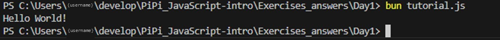

# Digitart_JavaScript-intro

JavaScript講習会では、Web開発において不可欠なプログラミング言語であるJavaScriptを通して基礎的な文法を学びます。  

## 目次

- はじめに
  - [事前設定](#01-事前設定)
  - [環境整備](#02-環境整備)
- Javascript基礎講習
  - Javascript開発の基礎
    - [Hello world!](#111-hello-world)
    - [コード記述のルール](#112-コード記述のルール)
    - [エラーメッセージ](#113-エラーメッセージ)
  - 変数とデータ型
    - [変数と定数](#121-変数と定数)
    - [データ型](#122-データ型)
  - 演算子
    - [算術演算子](#131-算術演算子)
    - [グループ化演算子](#132-グループ化演算子)
    - [比較演算子](#133-比較演算子)
  - 制御構文
    - [条件分岐](#141-条件分岐)
    - [反復処理](#142-反復処理)
  - 配列
    - [配列](#15-配列)
  - 関数
    - [関数の定義と実行](#161-関数の定義と実行)
    - [引数と戻り値](#162-引数と戻り値)
    - [スコープ](#163-スコープ)
- JavaScript基礎演習
  - Day1
    - [2.3-A1.](#23-a1-sin-x) $\sin x$
    - [2.3-A2.](#23-a2-dice) $dice$
    - [2.4.1-A3.](#241-a3-bmi) $BMI$
    - [2.4.1-A4.](#241-a4-nengoconverter) $NengoConverter$
    - [2.4.1-A5.](#241-a5-leapyear) $LeapYear$
  - Day2
    - [2.4.2-A6.](#242-a6-sigma) $Sigma$
    - [2.4.2-B7.](#242-b7-collatz) $Collatz$
    - [2.4.2-B8.](#242-b8-sqrt) $Sqrt$
    - [2.4.2-B9.](#242-b9-binary) $Binary$
    - [2.4.2-B10.](#242-b10-euclidean) $Euclidean$
  - Day3
    - [2.5.1-A11.](#251-a11-ctm) $CTM$
    - [2.5.1-A12.](#251-a12-anka) $Anka$
    - [2.5.1-B13.](#251-b13-anka) $Anka+$
    - [2.5.1-B14.](#251-b14-kiyoshi) $KIYOSHI!$
    - [2.5.1-B15.](#251-b15-sort) $Sort$
  - Day4
    - [2.6-B16.](#26-b16-manufacturer) $Manufacturer$
    - [2.6-B17.](#26-b17-alivedays) $AliveDays$
    - [2.6-B18.](#26-b18-lottery) $Lottery$
    - [2.6-C19.](#26-c19-fibonatti) $Fibonatti$
    - [2.6-C20.](#26-c20-halfadder) $HalfAdder$

## 0. はじめに
今回の実習で使うものの準備をします！
### 0.1. 事前設定
JavaScript講習会では事前に以下の環境が整っている前提で進められます。
 - Visual Studio Code  

<details><summary>VScodeのダウンロード手順</summary>

1. Visual Studio Code のダウンロード用サイト( https://code.visualstudio.com/download )にアクセスし、対応するOSのものをダウンロードする。


2. ダウンロードされたexeファイル(`VSCodeUserSetup-x64-1.99.2.exe`など)を展開し、画面上に表示される指示に従いセットアップする。(基本的には初期設定のままでOK)


3. インストールが完了したら、「完了(F)」をクリックしてインストールを終了する。中央にあるチェックボックスにチェックが入っていると、終了と同時にVisual Studio Codeが起動する。


</details>

> [!IMPORTANT]
> 何か問題が起きたら気軽に相談しましょう！

### 0.2. 環境整備

#### 0.2.1. フォルダの作成
演習用のファイルを収納するフォルダを作成しましょう！  
自分の好きな場所に作成して大丈夫ですが、以下のようにファイルを作成することをお勧めします。
> 1. `C: > User > {UserName}`直下に`develops`フォルダを作成する。
> 2. その下に`PiedPiper > Javascript`とファイルを作成する。


#### 0.2.2. VS Code上で表示
VS Codeを起動し、`フォルダーを開く`から先ほど作成したフォルダを選択し、右下部`フォルダの選択`をクリックしてください。 
これにより、フォルダ内のファイルがVS Code上で表示され、編集可能になります。  
また、フォルダを開いた状態で新しいファイルを作成するには、エクスプローラーの上部にある「新しいファイル」アイコンをクリックし、ファイル名を入力してください。  
練習: `tutorial.js` という名前のファイルを作成してください。


#### 0.2.3. Bunのインストール
PowerShell上で以下のコマンドを実行してBunをインストールしましょう。
```bash
powershell -c "irm bun.sh/install.ps1 | iex"
```

<details><summary>PowerShellが表示されない場合</summary>

PowerShellが表示されていない(画面下部にウインドウがない)場合は、以下のようにして表示させてください。

1. ウインドウ上部の「パネルの切り替え」をクリックします。

2. 画面下部に「ターミナル」ウインドウが表示されます。
3. ウインドウ右上に`powershell`と表示されていることを確認してください。

表示されていない場合：上画像で示した部分の赤枠右側にある`∨`をクリックし、`PowerShell`を選択して作成してください。

これでPowershellが表示され、プログラムを実行及び結果の確認をすることができます。
</details>

> [!TIP]
> Bunとは
> JavaScript実行環境の1つである。高速な起動と実行、組み込みのバンドラー・テストランナー・パッケージマネージャー（npm互換のbun installなど）を特徴としています。


## 1. JavaScript基礎講習

### 1.1. JavaScript開発の基礎

#### 1.1.1. Hello world!
早速ですがプログラミングを始めていきましょう！  
その前にVScode上にある"出力(console)"に「Hello world!」という文字を出してみます。
tutorial.jsに以下のコードを書いてから実行してみましょう。

```javascript
console.log("Hello world!");
```

bunのコマンドを打つことでVS Code下部のターミナルに実行結果が出力されます。以下のコマンドを打ってください。
```bash
bun tutorial.js
```

> [!TIP]
> - Hello world!とは
>   プログラミング言語の学習を始めるにあたって、必ず最初に唱えることになっているおまじないである。  
>   このおまじないを唱えると画面に「Hello World!」と表示され、動作はただそれだけである。  
>   初学者の学習の道筋を清めるための一種の地鎮祭のようなものである。  

ターミナルに「Hello world!」と表示されたら成功です。  
`console.log()`というコマンドで、括弧内の要素をコンソールへ出力することができるので覚えておきましょう。

<details><summary>エラーが出るとき</summary>

次のようなエラーが表示されますか?!

```bash
error: Module not found "tutorial.js"
```

このエラーは現在のディレクトリに実行したいファイル(`tutorial.js`など)が存在しないときに表示されるエラーです。  
PowerShellにも、エクスプローラーと同じように現在表示している場所（カレントディレクトリ）があります。カレントディレクトリは既にPowerShell上に表示されています。文字を入力できる箇所の左側に次のような文字列が表示されているはずです。

```bash
PS C:\Users\{UserName}\develops\PiedPiper\JavaScript> 
```

このような場合、その指し示す位置が現在表示している場所です。試しにエクスプローラーでその住所を表示してみてください。（例の場合、エクスプローラー上部のカレントディレクトリを示す場所に`C:\Users\{UserName}\develops\PiedPiper\JavaScript`と入力し実行する。）  

カレントディレクトリを実行したいファイルが収納されているフォルダに移動していきましょう！
ディレクトリの移動や内容の確認を行うために使用する基本的なコマンドが `ls` と `cd` です。

##### lsコマンド
`ls` は "list" の略で、現在のディレクトリ内のファイルやフォルダを一覧表示するために使用します。

- 基本構文:
  ```bash
  ls [オプション]
  ```
- 使用例:
  ```bash
  ls
  ```
  上記のコマンドは、現在のディレクトリ内のファイルやフォルダを一覧表示します。

##### cdコマンド
`cd` は "change directory" の略で、現在の作業ディレクトリを変更するために使用します。

- 基本構文:
  ```bash
  cd [ディレクトリ名]
  ```
- 使用例:
  ```bash
  cd PiedPiper
  ```
  上記のコマンドは、現在のディレクトリから `PiedPiper/` というディレクトリに移動します。

- 特殊な使い方:
  - `cd ..` : 親ディレクトリ(1つ上のディレクトリ)に移動します。
  - `cd ~` : ホームディレクトリに移動します。

</details>

> [!NOTE]
> コンソールとは、プログラムの実行結果やエラーメッセージなどを表示するための画面やウィンドウのことです。  
> プログラミングを行う際には、コンソールを使ってプログラムの動作を確認したりデバッグを行ったりします。  
> Bunを使用した場合、コードを実行したらPowerShellのターミナル上に出力が以下のように表示されます。
> 
> 
> Visual Studio Codeでは、画面下部に「出力」や「デバッグコンソール」といったタブがあり、ここにプログラムの実行結果が表示されます。  
> プログラムが正しく動作しているかどうかを確認するために、コンソールを活用しましょう。

#### 1.1.2. コード記述のルール

<details><summary>1.1.2.1. 大文字/小文字の区別</summary>

JavaScriptでは大文字と小文字が区別されます。例えば、`variable` と `Variable` は異なる変数として扱われます。次の例を見てみましょう。

```javascript
let variable = "小文字";
let Variable = "大文字";

console.log(variable);
console.log(Variable);
> 小文字
> 大文字
```

このように、変数名の大文字と小文字を間違えると意図しない動作を引き起こす可能性があるため、注意が必要です。
</details>

<details><summary>1.1.2.2. 全角/半角の区別</summary>

JavaScriptでは全角と半角の文字が区別されます。例えば、全角のスペースと半角のスペースは異なる文字として扱われます。次の例を見てみましょう。

```javascript
let fullWidthSpace = "　"; // 全角スペース
let halfWidthSpace = " "; // 半角スペース

console.log(fullWidthSpace === halfWidthSpace);
> false
```

このように、全角と半角の違いを意識してコードを書く必要があります。特に、文字列の比較や入力の検証を行う際には注意が必要です。
</details>

<details><summary>1.1.2.3. 空白文字</summary>

空白文字は、コードの可読性を高めるために適切に使用する必要があります。JavaScriptでは、空白文字（スペース、タブ、改行など）は無視されるため、コードの動作には影響しませんが、適切に配置することでコードの見やすさが向上します。

例えば、次のように空白文字を使ってコードを整形します。

```javascript
let sum = 1 + 2; // スペースを使って可読性を向上
let product = 3 * 4; // スペースを使って可読性を向上

if (sum > product) {
  console.log("Sum is greater than product");
} else {
  console.log("Product is greater than or equal to sum");
}
```

このように、適切な場所に空白文字を入れることで、コードの可読性が向上し、他の開発者が理解しやすくなります。
</details>

<details><summary>1.1.2.4. セミコロン</summary>

JavaScriptでは、文の終わりにセミコロン（`;`）を付けることが推奨されています。セミコロンを付けることで、文の区切りが明確になり、コードの可読性が向上します。また、セミコロンを省略すると、JavaScriptの自動セミコロン挿入（ASI）機能により予期しない動作を引き起こす可能性があります。

例えば、次のようにセミコロンを省略した場合、意図しない結果になることがあります。

```javascript
let a = 1
let b = 2
let c = a + b
(function() {
  console.log(c)
})()
```

このコードはエラーを引き起こしますが、セミコロンを適切に挿入することで解決できます。

```javascript
let a = 1;
let b = 2;
let c = a + b;
(function() {
  console.log(c);
})();
```

このように、セミコロンを適切に使用することで、コードの予期しない動作を防ぐことができます。
</details>

<details><summary>1.1.2.5. コメント</summary>

コードにコメントを追加することで、コードの意図や動作を説明し、他の開発者や将来の自分が理解しやすくなります。JavaScriptでは、以下のようにコメントを記述します。

- シングルラインコメント: `//` を使って1行のコメントを記述します。
```javascript
// これはシングルラインコメントです
console.log("Hello world!"); // この行の後ろにもコメントを追加できます
```

- マルチラインコメント: `/* */` を使って複数行のコメントを記述します。
```javascript
/*
  これはマルチラインコメントです。
  複数行にわたるコメントを記述できます。
*/
console.log("Hello world!");
```

コメントを適切に使用することで、コードの可読性が向上し、他の開発者がコードを理解しやすくなります。
</details>

### 1.1.3. エラーメッセージ
<details><summary>詳細を表示</summary>

エラーメッセージは、プログラムの実行中に発生した問題を知らせるために表示されるメッセージです。エラーメッセージを正しく理解し、適切に対処することで、プログラムのバグを効率的に修正できます。

#### 1.1.3.1. エラーの種類
JavaScript講習会では、以下のようなエラーが発生することを想定しています。

- **構文エラー (SyntaxError)**  
  コードの文法が間違っている場合に発生します。  
  例:  
  ```javascript
  console.log("Hello world! // 閉じ忘れ
  > SyntaxError: Unexpected end of input
  ```

- **参照エラー (ReferenceError)**  
  存在しない変数や関数を参照した場合に発生します。  
  例:  
  ```javascript
  console.log(wit);
  > ReferenceError: wit is not defined
  ```

#### 1.1.3.2. エラーメッセージの読み方
エラーメッセージには、エラーの種類、原因、発生箇所が記載されています。以下の例を見てみましょう。

```bash
Uncaught ReferenceError: x is not defined
    at main.js:2:1
```

- **エラーの種類**: `ReferenceError`  
- **エラーの原因**: `x is not defined`  
- **発生箇所**: `main.js` の 2 行目

</details>

> [!IMPORTANT]
> エラーメッセージは友達です。何故か想定外の動作をする状況より100倍マシ。

### 1.2. 変数とデータ型

### 1.2.1. 変数と定数

#### 1.2.1.1. 変数宣言 
変数とは、プロフラムで使われる値を名前付きで管理する**ラベルのようなもの**です。プログラムを書いていると同じ値を何度も使ったり一時的に値を保持したいケースが出てきます。このようなときに次のように変数で値に対して名前を付けておけば任意のタイミングで繰り返し使用できます。
```javascript
let text = "Hello world!";
console.log(text);
> Hello world!
```
変数を使用する際には主に`let`というコマンドを記述します。また、一度値を設定すると変更ができない特殊な変数(**定数**)もあります。  
|       | 再代入 |
| :---: | :-: |
| const | ×   |
| let   | 〇   |

変数を使うにはまず変数の宣言をする必要があります。
```javascript
let 変数名 = 値
```

変数名(**識別子**という)はある程度決まった形式で命名しますが基本的に半角英数字で命名します。

#### 1.2.1.2. 値の再代入
まずは`let`を使って宣言した変数の値を上書きする方法について確認していきます。(このことを値の**再代入**という)
```javascript
let msg = "Good morning!";
console.log(msg);
msg = "Hello!";
console.log(msg);

> Good morning!
> Hello!
```

> [!TIP]
> 定数(const)を使った場合には値の再代入を行うことができません。
> ```javascript
> const msg = "Good morning!";
> msg = "Hello!";
> > Uncaught TypeError TypeError: Assignment to constant variable. [訳:型エラー：定数に対する値の代入]

> [!NOTE]
> 識別子の命名規則
> JavaScriptでは次のルールに従って識別子の命名を行うことができます。
> ```
> 識別子の命名規則
> - 予約語は使用できない(const const=2などはできない)
> - 1文字目は必ずアルファベットorアンダースコア(_)orドル記号($)から始めなければならない(数値は使用不可)
> - 2文字目以降は数値も使用可能
> - 大文字と小文字は区別される
> - Unicodeのアルファベットなども使用可能。しかしバグの原因となるため特別な理由があるとき以外は使用しないこと
> ```
> 識別子の命名には一般的にキャメルケース、スネークケースなどが使われます。
> <details><summary>キャメルケース</summary>
> 単語と単語を統合して1つ目の単語は小文字ではじめそれ以降の単語は大文字で始める(personName)
> 
> </details>
> <details><summary>スネークケース</summary>
> 単語と単語をアンダースコアで統合しすべて小文字で表現する(person_nameなど)
> 
> </details>

### 1.2.2. データ型

#### 1.2.2.1. 文字列(String)
文字列型は文字の集合(文字列)を表すデータ型です。(この文章も文字列である!)  
コード上で文字列を書くためには**シングルクォート**('), **ダブルクォート**("), または**バッククォート**(`)を使用します。
> [!TIP]
> 1.1.1で実行した`console.log("Hello world!");`において、「Hello world!」の両端を「"」で囲んだのは文字列として認識させるためです。シングルクォートやバッククォートを使用しても同様に文字列として認識されます。

JavaScriptの場合は、シングルクォートまたはダブルクォートのどちらを使用しても特に違いはありません。一方、前後でクォートの種類が異なるとエラーとなります。
```javascript
console.log("これはエラーになります');
```
文字列同士はプラス(+)の演算子を使って結合できます。
```javascript
console.log("こんにちは、" + "くろむ" + "さん。");
> こんにちは、くろむさん。
```

#### 1.2.2.2. 数値(Number)
数値型は数値を表すデータ型です。  
数値型は $`-(2^{53}-1)`$ から $`2^{53}-1`$ までの数値を表現できます。
```javascript
console.log(1 + 2);
> 3
```
文字列型における数字と数値型における数値は、見た目は同じでも異なるデータとして扱われます。
文字列型における数字はあくまで「文字」として扱われるため、計算には直接使用できません。
```javascript
console.log(1 + "2");
> "12"
```

#### 1.2.2.3. BigInt
<details><summary>詳細を表示</summary>

BigInt型 は、非常に大きな整数を扱うためのデータ型です。数値型は $`-(2^{53}-1)`$ から $`2^{53}-1`$ までの数値しか表せず、その範囲を超える整数の場合には値が丸め込まれます。一方でBigIntの場合には数値型では表せない値の範囲を表現できます。  
数値の末尾に**n**をつけることでBigInt型の数値として定義できます。
```javascript
//Number型では正常処理の範囲外のため誤った値が表示される
console.log( 2 ** 53 + 1 );
> 9007199254740992
//BigInt型であれば問題なく表示可能
console.log( 2n ** 53n + 1n );
> 9007199254740993n
```

なお、このBigInt型と数値型は混在して使用することができないため注意してください。
また、BigIntはあくまで整数値を表す方になるため小数点以下の値は切り捨てられます。
```javascript
const num = 5n;
const den = 4n;
console.log( num / den );
> 1n  //小数点以下は切り捨てられる( 1.25 -> 1 )
```
</details>

#### 1.2.2.4. 真偽値(Boolean)
真偽値は**true**または**false**という値をとります。trueの場合には真, falseの場合には偽ということになります。真偽値はifなどの条件文と併せて使われることが多々あります。(条件文は[1.4.1](#141-条件分岐)で解説)  
真偽値は等価性の結果として返されることがしばしばあります。(等価性は[1.3.3](#133-等価演算子)で解説)
```javascript
console.log( 3 == 3 );
> true
console.log( 3 == 5 );
> false
```

#### 1.2.2.5. null
nullは参照を保持していないことを表します。すなわち「変数が空である」ことを意図的に表す特別な型です。

> [!TIP]
> ```
> 1 ：仕様書無しさん ：02/06/20 15:09  
> 　  ∧＿∧ 　　   
> 　（　´∀｀）＜　ぬるぽ    
> 
> 2 ：仕様書無しさん ：02/06/20 15:11  
>   
> 　 （　・∀・）　　　|　|　ｶﾞｯ  
> 　 と　　　　）　 　 |　|  
> 　　    Ｙ　/ノ　　　 人  
> 　　　   /　）　 　 < 　>__Λ∩  
> 　     ＿/し'　／／. Ｖ｀Д´）/ ←>>1  
> 　    （＿フ彡　　　　　 　　/  
> ```

#### 1.2.2.6. undefined
undefinedは変数が未定義であることを表しています。変数を制限するときに値を代入しない場合には、undefinedがプログラムによって自動的に設定されます。
```javascript
let hoge;
console.log( hoge );
> undefined
```

### 1.3. 演算子
演算子とは値をもとに何かしらの処理を行いその結果を返す記号のことです。これまで使ってきた"="や"+"などの記号がそれに該当します。

#### 1.3.1. 算術演算子
算術演算子は、数値を使った計算を行いその結果を返す演算子です。基本的な四則演算(加算・減算・乗算・除算)に加えて、剰余(余り)を求める演算子などがあります。
| 演算子 | 用途   | 例     | 結果 | 
| :----: | :---: | :----: | :---: | 
| +      | 加算   | 5 + 3  | 8    | 
| -      | 減算   | 10 - 4 | 6    | 
| *      | 乗算   | 6 * 2  | 12   | 
| /      | 除算   | 9 / 3  | 3    | 
| %      | 剰余   | 10 % 3 | 1    | 
| **     | べき乗 | 2 ** 3 | 8    | 

#### 1.3.2. グループ化演算子
グループ化演算子`()`は通常の演算子の優先順位を変更し、意図した順番で計算を行うことができます。
```javascript
console.log( 2 + 3 * 4);
> 14
console.log( ( 2 + 3 ) * 4);
> 20
```

#### 1.3.3. 比較演算子
比較演算子は、2つの値を比較し結果として真(true)または偽(false)を返す演算子です。これにより値の大小関係や等価性をチェックすることができます。
| 演算子 | 用途                 | 例     | 結果  | 
| :----: | :-----------------: | :----: | :---: | 
| ==     | 等価(イコール)       | 5 == 5 | true  | 
| !=     | 非等価(notイコール)  | 5 != 5 | false | 
| >      | より大きい(大なり)   | 5 > 3  | true  | 
| <      | より小さい(小なり)   | 5 < 3  | false | 
| >=     | 以上(大なりイコール) | 5 >= 3 | true  | 
| <=     | 以下(小なりイコール) | 5 <= 3 | false | 


ここまで学んだ内容をもとに演習問題に挑戦してみましょう！問題を解くことで、JavaScriptの基礎をより深く理解することができます。  
演習問題： [【リンク】](#23-a1-sin-x)

### 1.4. 制御構文

#### 1.4.1. 条件分岐
「もし〇〇なら～～を実行する」という処理により、特定の条件にのみ実行される処理を書きましょう。  
javascriptのif文は、ifに続く丸括弧()内の条件式がtrueの場合、それに続く波括弧{}内の処理を実行します。条件式がfalseの場合には{}内の処理は実行せずif文の次の行に処理を進めます。
```javascript
if( 条件式 ){
  ifブロック
}
```
もっとも単純化した例は次の通りです。
```javascript
let hasFlag = true;
if( hasFlag ){
  console.log("cleard");
}
> cleard
```
また、比較演算子を使用することにより次のような実装をすることができます。
```javascript
let score = 100;
if( score == 100 ){
  console.log("Excellent!!");
}
> Excellent!!
```
else ifやelseを使うことで、条件式がfalseの場合に別の処理を実行することができます。
```javascript
let score = 70;
if( score == 100 ){
  console.log("Excellent!!");
} else if (score >= 80) {
  console.log("Good!");
} else if (score >= 60) {
  console.log("Pass");
} else {
  console.log("Bad");
}
> Pass
```
この例ではscoreが100の場合は"Excellent!!",80以上100未満の場合は"Good!",60以上80未満の場合は"Pass",それ以下の場合は"Bad"と表示されます。  

演習問題： [【リンク】](#241-a3)

#### 1.4.2. 反復処理
開発では同じ処理を何度も繰り返し行うことがあります。試しに"Loading..."と5回出力するプログラムを書いてみましょう。
```javascript
console.log("Loading...");
console.log("Loading...");
console.log("Loading...");
console.log("Loading...");
console.log("Loading...");
> Loading...
> Loading...
> Loading...
> Loading...
> Loading...
```
5回程度なら面倒な思いをして可読性の悪いコードを書けば済みますが煩雑です。そこで反復処理を行います。  
反復処理は同じ処理を繰り返し実行するための構文です。JavaScriptではwhile文やfor文を使って反復処理を行います。

#### 1.4.2.1. while文
while文は条件式がtrueのときに処理を繰り返し、falseが取得されたときに処理を抜けます。
```javascript
while( 条件式 ){
  whileブロック
}
```
もっとも単純化した例は次の通りです。
```javascript
let cnt = 0;
while( cnt < 5 ){
  console.log(cnt);
  cnt += 1;
}
> 0
> 1
> 2
> 3
> 4
```

> [!TIPS]
> - break文について
> 
> `break`文は、現在のループやスイッチ文の実行を中断し、制御をその外側に移すために使用されます。主に以下のような場面で利用されます：
> 
> **ループの中断**:
>   - `for`、`while`ループ内で特定の条件が満たされた場合にループを終了します。
> 
> ```javascript
> let cnt = 0;
> while( cnt < 5>){
>   console.log(cnt);
>   cnt += 1;
>   if(cnt == 3){
>     break
>   }
> }
> console.log("Task Complete!")
> > 0
> > 1
> > 2
> > 3 // cntが3になったのでif文からbreak->実行を中断している
> > "Task Complete!"
> ```

#### 1.4.2.2. for文
for文は初期化処理,条件式,更新式を用いて繰り返し処理を行います。実行する回数が決まっている場合はwhileではなくforを使用することが一般的です。
```javascript
for( 初期化処理 ; 条件式 ; 更新式 ){
  forブロック
}
```
もっとも単純化した例は次の通りです。
```javascript
for( idx = 0 ; idx < 5 ; idx++ ){
  console.log(idx);
}
> 0
> 1
> 2
> 3
> 4
```

演習問題： [【リンク】](#242-a6-pi)

### 1.5. 配列

複数の値を1つの変数にまとめて格納したものを「配列」といいます。そこに値を代入したり参照したりして使用します。  
まずは配列を作ってみましょう。
```javascript
let menu = ["pizza","pasta","meat","soup","dessert"];
```
変数"menu"に配列を代入しました。各要素はコンマで区切られており5つの要素が含まれています。

#### 1.5.1. 配列の基本操作
生成した配列の特定の値を取得・変更したい場合には添字(index)を使います。
```javascript
console.log(menu[0]); //0番目の要素を取得
> "pizza"
menu[3] = "bread"; //4番目の要素を変更
console.log(menu);
> ["pizza","pasta","meat","bread","dessert"]
```
配列に要素を追加したい場合には`push`などを使用します。
```javascript
menu.push("soup") //末尾に要素を追加
console.log(menu);
> ["pizza","pasta","meat","bread","dessert","soup"]
```
逆に要素を削除したい場合には`pop`などを使用します。
```javascript
menu.pop() //末尾の要素を削除
console.log(menu);
> ["pizza","pasta","meat","bread","dessert"]
```

#### 1.5.2. 配列の活用例
for文を使用することにより配列の要素を順番に処理することができます。例えば配列の全要素を出力する場合は次のようにすることができます。
```javascript
let menu = ["pizza", "pasta", "meat", "bread", "dessert"];
for (let i = 0; i < menu.length; i++) {
    console.log(menu[i]);
}
> pizza
> pasta
> meat
> bread
> dessert
```
menu.lengthにより配列の要素数をforループの上限数としています。  

演習問題： [【リンク】](#251-a11)

### 1.6. 関数
関数とは、一連の処理のまとまりに名前を付けて1つの処理として扱う機能です。  
複数回行う処理について、関数を使用することにより一度定義した関数を呼び出すことにより同じ処理を実行できます。

#### 1.6.1. 関数の定義と実行
関数は以下のように定義することができます。
```javascript
function hoge() { // 関数の定義
    functionブロック
}
```
関数は呼び出されない限り実行されません。そのため関数を呼び出すコマンドを通して関数の処理を行います。
```javascript
greet()  // 関数の呼び出し
console.log("Leaving a function");

function greet() {
    console.log("Hello, World!");
}

> "Hello, World!"
> "Leaving a function"
```
`関数名()`の形で関数を呼び出すことができ、その中身の処理が終了すると呼び出した次の行へ処理が移ります。

#### 1.6.2. 引数と戻り値
関数内で宣言した変数はその関数のブロック内でのみ有効です。しかしある関数から別の関数を呼び出す際に、その関数内で必要な値を渡したり、処理結果を呼び出し元の関数に返したりすることがあります。前者を「引数」、後者を「戻り値」と呼びます。
```javascript
console.log(add(1,2));

function add(a,b) {
    return a + b
}

> 3
```
このコードでは、add という関数を定義し、それを使って `1` と `2` を加算しています。  
- `console.log(add(1,2))` が実行されると、まず `add(1,2)` の結果を求めるために **add関数**が呼び出されます。  
- **add関数**では、引数 `a = 1`、`b = 2` を受け取り、それらを加算した結果 `3` を `return` で返します。  
- `console.log` によって、戻り値 `3` が出力されます。  

関数を呼び出し、引数を渡して処理を行い、その結果を戻り値として返すという仕組みになっています。

#### 1.6.3. スコープ
実行中のコードには参照できる変数や関数の範囲があり、これをスコープといいます。  
関数間での値の受け渡しで引数や戻り値を使ったのは、ある関数の中で作った変数（ローカル変数）が、その関数の外で使えないためです。
```javascript
let msg1 = "グローバル変数";

main()

function main() {
    console.log(msg1);
    console.log(msg2);
}

function defMsg() {
    let msg2 = "ローカル変数";
}

> "グローバル変数"
> Uncaught ReferenceError ReferenceError: msg2 is not defined
```
このコードを実行すると、`msg1` は正常に表示されますが、`msg2` にはエラーが発生します。  
これは `msg1` が関数の外で定義された **グローバル変数** であり、プログラムのどこからでも参照できるためです。
一方で `msg2` は関数内で定義された **ローカル変数** であり、その関数の外では参照できません。  
すべての変数をグローバル変数として定義する方法はバグの原因になること、可読性が低下すること等を招くため絶対に推奨できません。  

演習問題： [【リンク】](#26-b16-manufacturer)

## 2. JavaScript基礎演習

### 2.3-A1. $`TImeConversion`$
1分間は60秒である。合計の秒数が与えられたとき、「分」と「秒」の値は以下のように求めることができる。
> $`min = \text{totalSeconds} \div 60 \text{  (整数部分)}`$  
> $`sec = \text{totalSeconds} \pmod{60} \text{ (余り)}`$

これを利用して$`135`$秒が「何分何秒」になるか計算せよ。
```javascript
let totalSeconds = 135;
let min = 0;
let sec = 0;

//WRITE ME!!

console.log(min + "分" + sec + "秒");
```

<details><summary>入力と出力</summary>

```
[in]
totalSeconds = 135

[out]
2分15秒
```
</details>

### 2.3-A2. $`dice`$
公平な6面サイコロを1回振る。出た目を$`X`$とするとき、$`X`$が奇数である場合には $`true`$を、偶数である場合には $`false`$を出力せよ。
> [!NOTE]
> JavaScript において、`Math.random` と `Math.floor` を組み合わせることで、指定した範囲の乱数(整数)を生成できる。  
> `Math.random()` は 0 以上 1 未満の小数をランダムに返す関数である。この値に適切なスカラーを掛け、`Math.floor()` を使用して小数部分を切り捨てることで、整数範囲の乱数を得ることができる。


### 2.4.1-A3. $`BMI`$
BMI（Body Mass Index, 体格指数）は体重と身長から算出される値で、次の式で計算される。
> $`BMI = \frac{体重(kg)}{身長(m)^2}`$

BMIの値によって次のように分類される：18.5未満 : やせ型, 18.5以上25未満 : 標準, 25 以上 : 肥満  
体重と身長を入力として受け取り、BMIを算出し、その結果に応じて「やせ型」「標準」「肥満」を出力せよ。
```javascript
let weight = 60;  // 体重 (kg)
let height = 170;  // 身長 (cm)

let result = "";

// WRITE ME!!

console.log(result);
```

<details><summary>入力と出力</summary>

入出力例１
```
[in]
weight = 60
height = 170

[out]
標準
```
BMIを$`\frac{体重(kg)}{身長(m)^2}`$の式に則って計算すると`20.761245674740486`になり、この値は18.5以上25未満であるため「標準」が出力されます。  

入出力例２
```
[in]
weight = 60.3
height = 155

[out]
肥満
```

入出力例３
```
[in]
weight = 46
height = 167

[out]
やせ型
```

</details>

### 2.4.1-A4. $`NengoConverter`$
入力された西暦の年に対して、その年に対応する年号とその年号における年を表示せよ。  
昭和より前の年号に対しては「昭和以前です。」と表示すること。  
年号の対応は以下の通り：昭和:1926~, 平成:1989~, 令和:2019~ 
```javascript
let year = 2000;

let era = "";
let eraYear = 0;
```

<details><summary>入力と出力</summary>

入出力例１
```
[in]
year = 2000

[out]
平成12年
```
2000年は平成1年(1989年)以降であり、平成1年から数えて12年目なので「平成12年」が出力されます。

入出力例２
```
[in]
year = 2019

[out]
令和1年
```

入出力例３
```
[in]
year = 1920

[out]
昭和以前です。
```

</details>

### 2.4.1-A5. $`LeapYear`$
入力された年が閏年か否か判別せよ。閏年である条件は以下のとおりである。
- 西暦年が4で割り切れる年は閏年
- ただし、西暦年が100で割り切れる年は平年
- ただし、西暦年が400で割り切れる年は閏年

```javascript
let year = 2000;

// WRITE ME!!

```

<details><summary>入力と出力</summary>

入出力例1
```
[in]
year = 2025

[out]
平年
```
2000年は4で割り切れない年であるため平年です。

入出力例2
```
[in]
year = 2024

[out]
閏年
```
2024年は4で割り切れ、100で割り切ることができないので閏年です。

入出力例3
```
[in]
year = 1900

[out]
平年
```
1900年は4で割り切れる年であるが、100で割り切れる年なので平年です。

入出力例4
```
[in]
year = 2000

[out]
閏年
```
2000年は4で割り切れ、100で割り切れ、400でも割り切れる年なので閏年です。
</details>

### 2.4.2-A6. $`Sigma`$
1から1,000までの自然数の総和を求めよ。

<details><summary>入力と出力</summary>

入出力例
```
[in]
なし

[out]
500500
```

</details>

### 2.4.2-B7. $`Collatz`$
コラッツ予想とは、任意の自然数 $n$ に対して以下の操作を繰り返すと最終的に $1$ になるという未解決の数学的問題である。  
- $n$ が偶数なら $n = n / 2$ を行う。  
- $n$ が奇数なら $n = 3n + 1$ を行う。  
- $n = 1$ になったら終了する。  

1 以上 10,000 以下のすべての自然数についてこの操作を行ったとき、すべての数が 1 に到達することを確認せよ。

<details><summary>入力と出力</summary>

入出力例1
```
[in]
(なし)

[out]
true
```
</details>

### 2.4.2-B8. $`Sqrt`$
任意の変数numの平方根(２乗するとnumになる数)を求めます。resultを0から0.001ずつ増やしながら「しらみつぶし」に探してください。resultを２乗した値がnumを超えた瞬間にループを終了させなさい。
```javascript
let num = 2;
let result = 0;

// WRITE ME!!

console.log(num　+ "の平方はだいたい" + result + "です。");
```

<details><summary>入力と出力</summary>

入出力例1
```
[in]
num = 2
result = 0

[out]
2の平方はだいたい1.415です。
```

入出力例2
```
[in]
num = 1000
result = 0

[out]
1000の平方はだいたい31.623です。
```

入出力例3
```
[in]
num = 0.25
result = 0

[out]
0.25の平方はだいたい0.5です。
```
</details>

### 2.4.2-B9. $`Binary`$
任意の自然数(10進数)を2進数に変換せよ。
```javascript
let n = 1024;

// WRITE ME!!

console.log(result);
```

<details><summary>入力と出力</summary>

入出力例1
```
[in]
n = 1024

[out]
10000000000
```

入出力例2
```
[in]
n = 25

[out]
11001
```

入出力例3
```
[in]
n = 255

[out]
11111111
```
</details>

### 2.4.2-B10. $`Euclidean`$
2 つの正の整数 $A$ と $B$ が与えられたとき、ユークリッドの互除法を用いて 最大公約数（GCD） を求めよ。

ユークリッドの互除法の手順:

- $A$ を $B$ で割った余りを求める。
- 余りが 0 ならば $B$ が最大公約数となる。
- 余りが 0 でない場合、 $A$ を $B$ に、 $B$ を余りに置き換え、1 に戻る。

<details><summary>入力と出力</summary>

入出力例1
```
[in]
A = 56
B = 98

[out]
最大公約数: 14
```

入出力例2
```
[in]
A = 48
B = 18

[out]
最大公約数: 6
```

入出力例3
```
[in]
A = 101
B = 103

[out]
最大公約数: 1
```

</details>

### 2.5.1-A11. $`CTM`$
与えられた数値の配列から以下の平均値を求めよ。
- 平均値（Mean）: 配列内のすべての値の合計を要素数で割った値。
```javascript
let scores = [82, 53, 71, 15, 85, 71, 71, 41, 23, 74, 65, 15];

// WRITE ME!!

console.log("Mean:" + mean);
```

<details><summary>入力と出力</summary>

入出力例1
```
[in]
scores = [82, 53, 71, 15, 85, 71, 71, 41, 23, 74, 65, 15]

[out]
Mean: 55.5
```

入出力例2
```
[in]
scores = [100, 90, 80, 70, 60, 50]

[out]
Mean: 75
```

入出力例3
```
[in]
scores = [10, 20, 30, 40, 50]

[out]
Mean: 30
```
</details>

### 2.5.1-A12. $`Anka`$
サイゼリヤのメニューからランダムに選び続け、合計金額が1,000円を超えた時点で選んだメニューの一覧と合計金額を出力せよ。

<details><summary>コードテンプレート</summary>

```javascript
let budget = 1000;
let total_cost = 0;
let order_list = [];

let menu_list = [
[1202,"小エビのサラダ",350],
[1205,"わかめのサラダ",350],
[1209,"チキンのサラダ",350],
[1301,"コーンクリームスープ",150],
[1302,"冷たいパンプキンスープ",180],
[1305,"田舎風ミネストローネ",300],
[1307,"たまねぎのズッパ",300],
[1401,"辛味チキン",300],
[1402,"アロスティチーニ",400],
[1403,"ほうれん草のソテー",200],
[1404,"ポップコーンシュリンプ",300],
[1405,"エスカルゴのオーブン焼き",400],
[1406,"小エビのカクテル",280],
[1407,"チョリソー",400],
[1408,"蒸し鶏の香味ソース",280],
[1410,"ムール貝のガーリック焼き",400],
[1413,"キャロットラベ",200],
[1416,"ポテトのグリル",300],
[1417,"バッファローモッツァレラのカプレーゼ",430],
[1422,"ハモン・セラーノ",320],
[1423,"生ハムとバッファローモッツァレラの組み合わせ",500],
[1425,"柔らか青豆の温サラダ",200],
[1452,"【Wサイズ】アロスティチーニ",800],
[2101,"ミラノ風ドリア",300],
[2103,"半熟卵のミラノ風ドリア",350],
[2108,"焼きチーズミラノ風ドリア",350],
[2110,"たらことポップコーンシュリンプのドリア",400],
[2115,"ポップコーンシュリンプとたらこのクリームグラタン(全粒粉)",430],
[2203,"バッファオーモッツァレラのマルゲリータピザ",400],
[2204,"野菜ときのこのピザ",400],
[2206,"たっぷりコーンのピザ",400],
[2208,"ソーセージピザ",400],
[2301,"タラコソースシシリー風",400],
[2303,"ペペロンチーノ",300],
[2304,"パルマ風スパゲッティ",400],
[2305,"カルボナーラ",500],
[2306,"ミートソースボロニア風",400],
[2310,"スープ入り塩味ボンゴレ",500],
[2316,"半熟卵のミートソースボロニア風",450],
[2317,"半熟卵のペペロンチーノ",350],
[2138,"半熟卵のカルボナーラ"],
[2320,"小エビのタラコソース",540],
[2321,"キノコとほうれん草のクリームスパゲッティ",600],
[2325,"ペンネアラビアータ(全粒粉)",430],
[2328,"イカの墨入りセピアソース",500],
[2402,"若鶏のディアボラ風",500],
[2403,"イタリアンハンバーグ",500],
[2404,"柔らかチキンのチーズ焼き",500],
[2406,"ハンバーグステーキ",400],
[2407,"ディアボラ風ハンバーグ",500],
[2417,"ラム(仔羊)のランプステーキ",1090],
[2418,"ミックスグリル",650],
[3101,"ライス",150],
[3102,"ラージライス",200],
[3103,"スモールライス",100],
[3110,"フォッカチオ",150],
[3111,"ガーリックフォッカチオ",200],
[3112,"シナモンフォッカチオ",200],
[3114,"チーズフォッカチオ",250],
[3201,"ティラミス クラシコ",300],
[3205,"ミルクジェラート",250],
[3207,"チョコレートケーキ",300],
[3206,"イタリアンプリン",250],
[3212,"プリンとティラミス クラシコの盛り合わせ",500],
[3213,"トリフアイスクリーム",350],
[3214,"ジェラート＆シナモンフォッカチオ",450],
[3215,"コーヒーゼリー＆ミルクジェラート",350],
[3216,"チョコレートケーキ&ミルクジェラート",500],
[3301,"生ビールキリン一番搾り ジョッキ",400],
[3302,"生ビールキリン一番搾り グラスビール",280],
[3303,"ノンアルコールビール アサヒ ドライゼロ",250],
[3304,"キリン 氷結 シチリア産レモン",350],
[3306,"グラッパ(30ml)",300],
[3401,"グラスワイン 赤",100],
[3402,"グラスワイン 白",100],
[3403,"デカンタ小 赤",200],
[3404,"デカンタ小 白",200],
[3405,"デカンタ大 赤",400],
[3406,"デカンタ大 白",400],
[3407,"マグナム 赤",1100],
[3408,"マグナム 白",1100],
[3413,"ドンラファエロ",1100],
[3412,"ランブルスコロゼ",1100],
[3414,"ランブルスコセッコ",1100],
[3415,"ベルデッキオ",1100],
[3416,"キャンティ",1100],
[3419,"キャンティ ルフィナ リゼルバ",2200],
[4301,"トッピング半熟卵",50],
[4304,"トッピング野菜ソース",100],
[4307,"トッピング粉チーズ(グランモラビア)",100],
[5101,"セットドリンクバー",200],
[5102,"【キッズ】セットドリンクバー",100],
[5103,"単品ドリンクバー",300],
[5305,"サイゼリヤドレッシング",500],
[5306,"エクストラ・バージン・オリーブオイル(500ml)",1200]
];  //["商品番号","商品名","価格"]

//WRITE ME!!

console.log("注文: " + order_list);
console.log("合計: " + total_cost + "円");
```
</details>

<details><summary>入力と出力</summary>

出力例1
```
[out]
注文: アロスティチーニ,スモールライス,スイートコーン,カルボナーラ
合計: 1200円
```

出力例2
```
[out]
注文: トッピング半熟卵,単品ドリンクバー,サイゼリヤドレッシング,ラム(仔羊)と野菜のグリル
合計: 1720円
```

出力例3
```
[out]
注文: ライス,半熟卵のミラノ風ドリア,スイートコーン,野菜ときのこのピザ
合計: 1100円
```
</details>

### 2.5.1-B13. $`Anka+`$

2.5.1-A2. $`Anka`$ を改変することにより、合計金額が1,000円に近くなる*組み合わせを見つけて出力せよ。  
同じメニューを複数回注文しない、メイン料理を1品のみ注文する等、各自アレンジしてもよい。
> [!NOTE]
> 合計金額が980円から1,020円の範囲に収まるようにランダムに組み合わせを選ぶこと。

<details><summary>入力と出力</summary>

出力例1
```
[out]
注文: ガーリックフォッカチオ,たっぷりコーンのピザ,たらことポップコーンシュリンプのドリア
合計: 1000円
```

出力例2
```
[out]
注文: 焼きチーズミラノ風ドリア,ミックスグリル
合計: 1000円
```

出力例3
```
[out]
注文: イタリアンハンバーグ,プリンとティラミス クラシコの盛り合わせ
合計: 1000円
```
</details>

### 2.5.1-B14. $`KIYOSHI!`$
「ずん」と「どこ」をランダムに出力し続け、次の順番で出力されたときに「きよし！」と表示して処理を終了せよ。
> ずん → ずん → ずん → ずん → どこ  

例えば、次のような出力の流れになった場合：
```javascript
> ずん  
> ずん  
> どこ  
> ずん  
> ずん  
> ずん  
> ずん  
> どこ  
> きよし！
```
「ずんずんずんずんどこ」が成立したため、「きよし！」を出力して処理を終了する。
> [!NOTE]
> 「ずん」または「どこ」をランダムに出力し、「ずんずんずんずんどこ」の順番が成立した場合にのみ「きよし！」を出力し、プログラムを終了すること。


### 2.5.1-B15. $`Sort`$
配列 $`A`$ が与えられる。この配列を降順（大きい順）に並び替えて出力せよ。
```javascript
let A = [1,5,2,4,8,3,7,8,3,1,6,8,2,4,3,7,4,2,4,3];
let N = A.length;
```

<details><summary>入力と出力</summary>

入出力例1
```
[in]
A = [1,5,2,4,8,3,7,8,3,1,6,8,2,4,3,7,4,2,4,3]

[out]
[8, 8, 8, 7, 7, 6, 5, 4, 4, 4, 4, 3, 3, 3, 3, 2, 2, 2, 1, 1]
```

入出力例2
```
[in]
A = [10, 20, 30, 40, 50]

[out]
[50, 40, 30, 20, 10]
```

入出力例3
```
[in]
A = [100, 90, 80, 70, 60, 50]

[out]
[100, 90, 80, 70, 60, 50]
```

</details>

### 2.6-B16. $`Manufacturer`$
ある工房では、$`N`$ 個の工芸品 を製作する必要がある。各工芸品には製作日数が決まっており、工芸品 $`i`$ を作るには $`A[i]`$ 日かかる。
この工房には $`3`$ 人の職人 がおり、同時に工芸品を製作できる。ただし、以下の条件を遵守する必要がある。
- 各工芸品は $`1`$ 人の職人が単独で製作 する。（複数人で同時に1つの工芸品を作ることはできない）
- $`1`$ 人の職人は、$`1`$ 度に $`1`$ つの工芸品のみを製作可能。
- 工芸品の製作を 途中で別の職人に引き継ぐことはできない。
- 各職人の作業開始タイミングや順番は自由に決めてよい。

すべての工芸品の製作が完了するまでにかかる最短日数を求めよ。
```javascript
let A = [1,5,2,4,8,3,7,8,3,1,6,8,2,4,3,7,4,2,4,3];
let N = A.length;

//WRITE ME!!

console.log("最短日数：" + day + "日");
```

<details><summary>入力と出力</summary>

入出力例1
```
[in]
A = [1, 5, 2, 4, 8, 3, 7, 8, 3, 1, 6, 8, 2, 4, 3, 7, 4, 2, 4, 3]

[out]
最短日数：29日
```

入出力例2
```
[in]
A = [10, 20, 30, 40, 50]

[out]
最短日数：50日
```

入出力例3
```
[in]
A = [100, 90, 80, 70, 60, 50]

[out]
最短日数：150日
```

</details>

### 2.6-B17. $`AliveDays`$
生年月日を入力として受け取り、現在の日付までの経過日数を求めよ。ただし、閏年を考慮すること。([閏年の条件](#241-b5))
```javascript
function isLeapYear(year) {
    //WRITE ME!! (閏年判定)
}

let birthDate = [2005,9,27];

let date = new Date();
let nowDate = [date.getFullYear(),date.getMonth()+1,date.getDate()];

//WRITE ME!!

```

<details><summary>入力と出力</summary>

入出力例1
```
[in]
birthDate = [2005, 9, 27]
nowDate = [2025, 4, 29]

[out]
7154日
```

入出力例2
```
[in]
birthDate = [1837, 3, 25]
nowDate = [2025, 4, 29]

[out]
68701日
```

入出力例3
```
[in]
birthDate = [2022, 8, 8]
nowDate = [2025, 4, 29]

[out]
995日
```

</details>

### 2.6-B18. $`Lottery`$
100個のくじのうち 当たりが3つ含まれているとする。このとき、10回の試行で少なくとも1回は当たりを引く確率を求めよ。  
条件:
- 1回の試行では、100個のくじから1枚だけをランダムに引く。
- 引いたくじは 元に戻さない（非復元抽選）とする。
- この試行を 1000 回繰り返し、実際の確率をシミュレーションで求める。

<details><summary>ヒント</summary>


<details>

<details><summary>入力と出力</summary>

入出力例1
```
[out]
確率：0.273
```

入出力例2
```
[out]
確率：0.254
```

入出力例3
```
[out]
確率：0.268
```

</details>

### 2.6-C19. $`Fibonatti`$
以下の漸化式で定義される「フィボナッチ数列」の第 $N$ 項を求めるプログラムを作成しなさい。
- $F(1) = 1, \quad F(2) = 1$
- $F(n) = F(n-1) + F(n-2) \quad (n \geq 3)$

自然数 $N$ を入力として受け取り、フィボナッチ数列の $N$ 番目の値を出力せよ。

<details><summary>入力と出力</summary>

入出力例1
```
[in]
N = 10

[out]
55
```

入出力例2
```
[in]
N = 20

[out]
6765
```

入出力例3
```
[in]
N = 30

[out]
832040
```

</details>

### 2.6-C20. $`HalfAdder`$
2つの1ビットのバイナリ値を入力として受け取り、半加算器（Half Adder）を実装せよ。  
半加算器は以下の論理回路で構成される：
- 和（Sum）: $S = A \oplus B$（XOR 演算）
- 桁上げ（Carry）: $C = A \land B$（AND 演算）

出力は次のようになる。
|  $A$  |  $B$  |  $S$  |  $C$  | 
| :---: | :---: | :---: | :---: | 
| false | false | false | false | 
| false | true  | true  | false | 
| true  | false | true  | false | 
| true  | true  | false | true  | 

```javascript

function halfAdder(A, B) {
    let sum = false;
    let carry = false;

    // WRITE ME!!

    return { sum, carry }
}

let A = false;
let B = false;

let result = halfAdder(A, B);
console.log("Sum:", result.sum);
console.log("Carry:", result.carry);

function or(a, b) {
    let result = (a == true || b == true) ? true : false;
    return result
}

function and(a, b) {
    let result = (a == true && b == true) ? true : false;
    return result
}

function not(a) {
    return a == true ? false : true;
}

```

<details><summary>入力と出力</summary>

入出力例1
```
[in]
A = false
B = false

[out]
Sum: false
Carry: false
```

入出力例2
```
[in]
A = false
B = true

[out]
Sum: true
Carry: false
```

入出力例3
```
[in]
A = true
B = false

[out]
Sum: true
Carry: false
```

入出力例4
```
[in]
A = true
B = true

[out]
Sum: false
Carry: true
```
</details>

***
参考文献  
外村将大(2021).『独習JavaScript 新版』.翔泳社.
